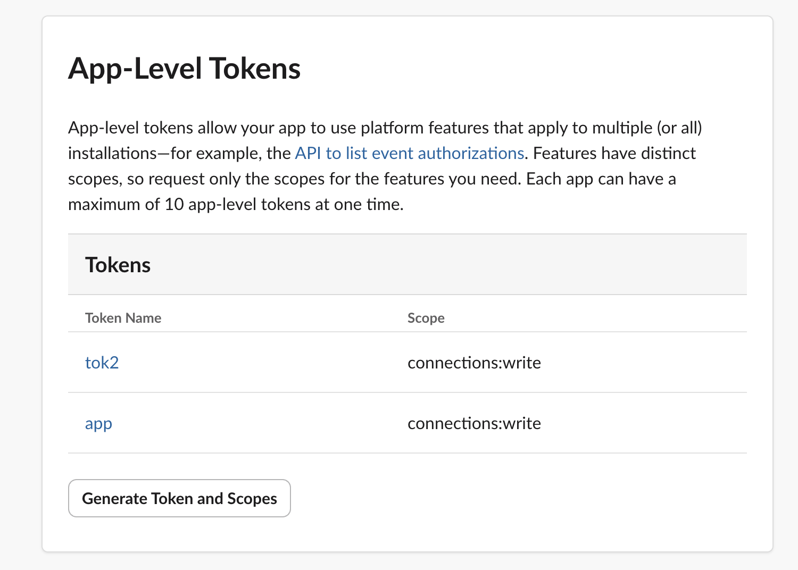
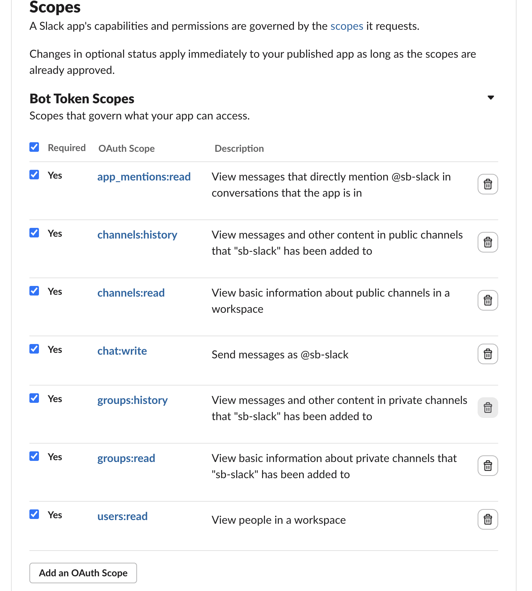
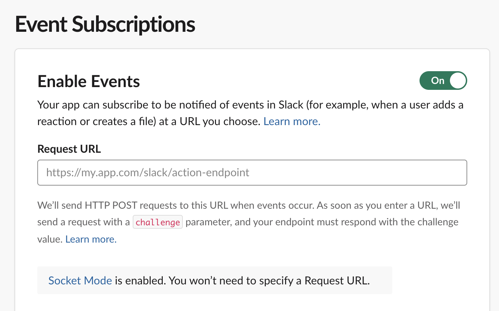

# Slack App Setup

This guide walks through creating the Slack app, granting OAuth scopes, enabling Socket Mode, and deploying the router.

---

## 1. Create the Slack App

1. Go to <https://api.slack.com/apps> → **Create New App** → **From scratch**
2. Name: e.g. `AI Dev Agent` (this becomes the display name users @mention)
3. Pick your workspace → **Create App**

---

## 2. Enable Socket Mode + Create App-Level Token

Socket Mode lets the router connect outbound — no public URL or ingress needed.

1. Left sidebar → **Socket Mode** → toggle **Enable Socket Mode** ON
2. Under **App-Level Tokens** → **Generate Token and Scopes**
   - Token name: e.g. `app`
   - Add scope: `connections:write`
   - **Generate** → copy the `xapp-...` token → this is `SLACK_APP_TOKEN`



---

## 3. OAuth Scopes (Bot Token)

1. Left sidebar → **OAuth & Permissions**
2. Under **Bot Token Scopes**, add all of the following:

| Scope | Purpose |
|-------|---------|
| `app_mentions:read` | Receive `@bot` mentions |
| `channels:history` | Read channel messages and thread replies |
| `channels:read` | Look up channel IDs from names |
| `chat:write` | Post messages to channels and threads |
| `groups:history` | Read private channel messages and thread replies |
| `groups:read` | Look up private channel IDs |
| `users:read` | Look up user display names |



3. Scroll to top → **Install to Workspace** → **Allow**
4. Copy the **Bot User OAuth Token** (`xoxb-...`) → this is `SLACK_BOT_TOKEN`

---

## 4. Event Subscriptions

1. Left sidebar → **Event Subscriptions** → toggle **Enable Events** ON
2. Because Socket Mode is active, you will see: _"Socket Mode is enabled. You won't need to specify a Request URL."_ Leave the URL field blank.



3. Expand **Subscribe to bot events** → Add:

| Event | Trigger |
|-------|---------|
| `app_mention` | User @mentions the bot in a channel |
| `message.channels` | Thread replies in public channels |
| `message.groups` | Thread replies in private channels |

4. **Save Changes**

---

## 5. Interactivity (Block Kit buttons)

Required for the PR review Approve / Request Changes buttons.

1. Left sidebar → **Interactivity & Shortcuts** → toggle **Interactivity** ON
2. Leave **Request URL** blank (Socket Mode handles it)
3. **Save Changes**

---

## 6. Invite the Bot to Channels

In each Slack channel where you want the bot to respond:

```
/invite @AI Dev Agent
```

To find the exact bot name after installation:
```bash
curl -s https://slack.com/api/auth.test \
  -H "Authorization: Bearer $SLACK_BOT_TOKEN" | python3 -c "import json,sys; d=json.load(sys.stdin); print('@' + d['user'])"
```

---

## 7. Deploy the Router

```bash
cd docs/examples

# First-time: create k8s secret, set org configs, deploy
./deploy-ai-slack-router.sh --create-k8s-secret --set-configs \
  --slack-channel "#your-team-channel" \
  --bot-name "@your-bot-name" \
  --default-tracker jira    # or "github"

# Re-deploy (configs already set):
./deploy-ai-slack-router.sh
```

### Required secrets (stored in k8s secret `ai-dev-credentials`)

| Variable | Description |
|----------|-------------|
| `SLACK_BOT_TOKEN` | `xoxb-...` from step 3 |
| `SLACK_APP_TOKEN` | `xapp-...` from step 2 |
| `FORMICARY_TOKEN` | Formicary bearer token |

### Key configuration (stored as Formicary org configs)

| Config key | Deploy flag | Default | Description |
|------------|-------------|---------|-------------|
| `SlackChannel` | `--slack-channel` | — | Default channel for standup posts |
| `SlackBotName` | `--bot-name` | `@bot` | Display name used in `@bot help` output |
| `DefaultTracker` | `--default-tracker` | `jira` | Routes bare commands (`standup`, `prs`) to Jira or GitHub workflows |
| `FormicaryPublicUrl` | `--public-url` | same as internal URL | Public URL for clickable job links posted to Slack |

---

## 8. Verify

Once the router pod is running:

```bash
kubectl logs -l app=ai-slack-router --tail=50 -f
```

You should see:
```
[router] connected to Slack via Socket Mode
```

In your Slack channel:
```
@AI Dev Agent help
```

The bot replies with the full command list and instructions for adding new skills.

---

## Troubleshooting

| Symptom | Fix |
|---------|-----|
| Bot doesn't respond to @mention | Check `app_mention` event is subscribed; bot is invited to channel (`/invite @botname`) |
| `invalid_auth` in logs | `SLACK_BOT_TOKEN` is wrong or expired — reinstall the app in workspace settings |
| `connection_failed` in logs | `SLACK_APP_TOKEN` wrong; regenerate at api.slack.com/apps → Socket Mode |
| Buttons don't work | Enable Interactivity in the app settings (step 5) |
| `channel_not_found` | Bot not invited; run `/invite @botname` |
| Help shows `@bot` not actual name | Set `--bot-name` flag when running deploy script |
| Thread replies not routed | Add `message.channels` and `message.groups` event subscriptions (step 4) |

---

## Adding a New Skill (no code changes needed)

1. Create `skills/ygs-<name>/SKILL.md` in [you-got-skills](https://github.com/bhatti/you-got-skills)
2. Add entry to `scripts/slack/skills.yml` (name, path, description)
3. Add entry to `scripts/slack/workflows.yml` (triggers, job_type, skill name)
   - For ad-hoc skills that just run a prompt and reply in Slack: set `job_type: ai-adhoc` with a `prompt:` field — no new workflow YAML needed
   - For new multi-step pipelines: add a YAML under `docs/examples/` and run `deploy-ai-jira-workflows.sh`
4. Rebuild and push: `make build push`
5. Restart router: `kubectl rollout restart deployment/ai-slack-router`

Trigger words drive routing entirely from YAML — `router.py` needs no changes.

---

## See Also

- [Architecture](architecture.md) — how the router, formicary, and Claude fit together
- [Configuration Reference](configuration.md) — all env vars
- [Kubernetes Deployment](k8s-deployment.md) — full K8s setup
